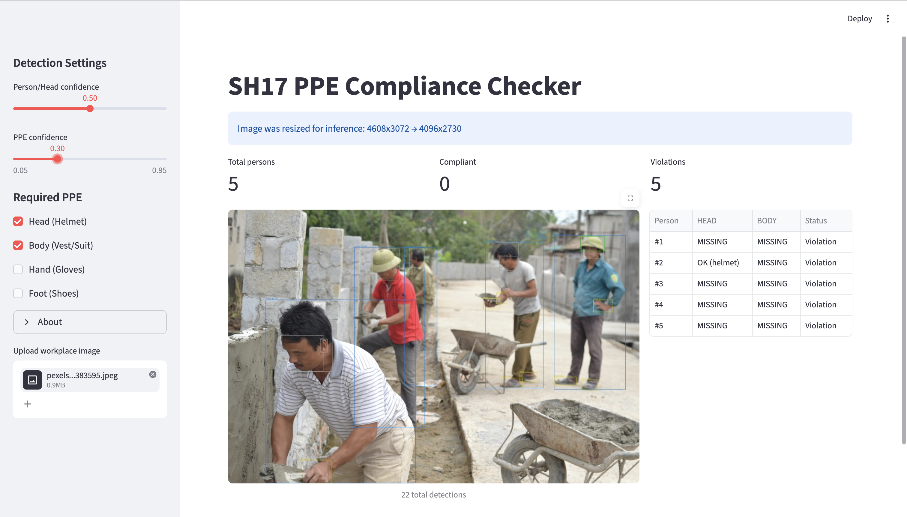
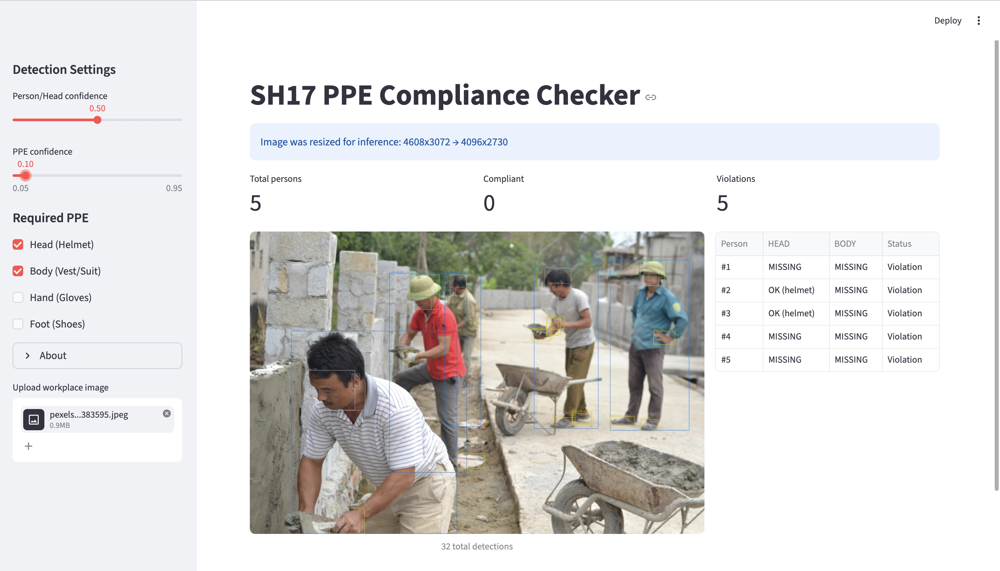

<div align="center">

# SH17 PPE Compliance Checker

**Ứng dụng phát hiện vi phạm Trang bị Bảo hộ Cá nhân (PPE) trong môi trường công nghiệp**

*Streamlit web app sử dụng YOLO + Computer Vision để kiểm tra compliance PPE từ ảnh tải lên*


</div>

---

## Demo



> Ảnh đầu vào được model phát hiện 17 classes PPE, sau đó logic compliance check sẽ gán PPE cho từng người và báo cáo vi phạm.

---

## Mục lục

1. [Tổng quan](#tổng-quan)
2. [Đóng góp — Từ paper gốc đến project](#đóng-góp--từ-paper-gốc-đến-project)
3. [Tính năng](#tính-năng)
4. [Công nghệ sử dụng](#công-nghệ-sử-dụng)
5. [Cài đặt](#cài-đặt)
6. [Cách sử dụng](#cách-sử-dụng)
7. [Kiến trúc hệ thống](#kiến-trúc-hệ-thống)
8. [Phương pháp](#phương-pháp)
9. [Dataset & Model](#dataset--model)
10. [Kết quả](#kết-quả)
11. [Hạn chế](#hạn-chế)
12. [Hướng phát triển](#hướng-phát-triển)
13. [Tài liệu tham khảo](#tài-liệu-tham-khảo)
14. [License](#license)

---

## Tổng quan

### Vấn đề

Tai nạn lao động vẫn là rủi ro nghiêm trọng trong các ngành công nghiệp như **xây dựng, sản xuất, hóa chất**. Phần lớn tai nạn có thể giảm thiểu nếu công nhân tuân thủ đúng quy định về **Personal Protective Equipment (PPE)** — mũ bảo hiểm, áo phản quang, găng tay, kính bảo hộ, giày an toàn... Tuy nhiên, việc giám sát thủ công bằng người quan sát tốn kém, dễ bỏ sót, và không thể bao phủ 24/7.

### Giải pháp

Project này xây dựng **hệ thống tự động phát hiện vi phạm PPE** dựa trên **Computer Vision**:
1. Người dùng tải lên ảnh hiện trường (workplace image)
2. Model **YOLO** (pre-trained trên dataset SH17) phát hiện 17 classes gồm `person`, `helmet`, `safety-vest`, `gloves`, `shoes`, v.v.
3. Logic **spatial association** gán mỗi PPE cho người gần nhất
4. Kiểm tra mỗi người có đầy đủ PPE bắt buộc (Head / Body / Hand / Foot) hay không
5. Trả về ảnh đã annotate + bảng báo cáo per-person

### Đối tượng

- Đồ án môn học **Computer Vision / Trí tuệ Nhân tạo / Hệ thống Nhúng**
- Demo nghiên cứu về workplace safety automation
- Khởi đầu cho production system (cần thêm fine-tuning + integration camera CCTV)

---

## Đóng góp — Từ paper gốc đến project

### Paper gốc giải quyết bài toán gì

Paper **SH17: A Dataset for Human Safety and PPE Detection in Manufacturing Industry** (Ahmad & Rahimi, 2024) đóng góp 3 thứ chính:

1. **Dataset**: 8,099 ảnh thu thập từ Pexels, annotate 75,994 instances thuộc 17 classes
2. **Benchmark**: Train + đánh giá 16 model variants (YOLOv8/v9/v10) trên dataset này, công bố pre-trained weights
3. **Cross-domain validation**: Đánh giá khả năng generalize của model tốt nhất (YOLOv9-e) trên Pictor-PPE dataset

→ Paper dừng ở task **PPE detection thuần** — phát hiện vị trí và nhãn của object PPE trong ảnh.

### Khoảng trống còn lại (Gap)

Detection chỉ cho biết "trong ảnh có những object gì". Câu hỏi quan trọng cho **workplace safety** thực tế là:

> *"Người nào không tuân thủ quy định PPE, và thiếu cái gì?"*

Để trả lời câu hỏi này từ raw detections, cần thêm các tầng logic mà paper gốc **không đề cập**:

- Làm sao biết helmet thuộc về ai trong ảnh có nhiều người?
- Làm sao phân biệt "đang đeo helmet" và "helmet để trên bàn"?
- Định nghĩa "compliant" cụ thể như thế nào — cần những PPE gì?
- Làm sao giải quyết class imbalance khiến model bỏ sót class PPE hiếm?
- Làm sao biến model nghiên cứu thành ứng dụng người dùng cuối có thể dùng?

### Chúng tôi mở rộng những gì

Project này xây **5 tầng mới chồng lên trên pre-trained weights của paper**:

#### 1. Spatial Association Algorithm (gán PPE cho đúng người)

Paper không có thuật toán gán PPE cho Person. Chúng tôi đề xuất **Containment Ratio**:

```
containment_ratio(inner, outer) = area(intersection) / area(inner)
```

PPE được gán cho Person nếu bbox PPE có **≥ 70% diện tích nằm trong** bbox Person. Không dùng IoU (đối xứng) vì PPE nhỏ trong Person lớn sẽ có IoU rất thấp (~1.6% cho helmet trong person).

**Hệ quả phụ:** Helmet trên kệ (ngoài Person bbox) → containment = 0 → không được gán → hệ thống tự nhận diện là "không có ai đeo helmet này" mà không cần model phân biệt "worn vs present".

#### 2. Compliance Rule System (định nghĩa thế nào là tuân thủ)

Paper liệt kê 17 classes rời rạc. Chúng tôi định nghĩa **4 nhóm bắt buộc theo body region** dựa trên hướng dẫn OSHA mà paper Section I có đề cập nhưng không cụ thể hóa:

| Group | PPE thay thế (logic OR) |
|---|---|
| `HEAD` | helmet |
| `BODY` | safety-vest HOẶC safety-suit HOẶC medical-suit |
| `HAND` | gloves |
| `FOOT` | shoes |

Người dùng tự chọn nhóm nào bắt buộc qua checkbox → linh hoạt theo từng môi trường (công trường vs y tế vs sản xuất).

#### 3. Dual Confidence Threshold (xử lý class imbalance)

Class imbalance trong SH17 (Fig. 2 của paper) khiến model dự đoán confidence không đồng đều giữa class:
- Class phổ biến (person 18.2%, head 15.8%) → confidence cao, threshold 0.5 OK
- Class PPE hiếm (helmet 1.2%, vest 0.7%, face-guard 0.2%) → confidence thấp, threshold 0.5 sẽ filter mất

Paper báo cáo mAP nhưng không đề xuất giải pháp inference. Chúng tôi tách **2 slider riêng** cho user fine-tune từng nhóm.

#### 4. End-to-End Web Application (đóng gói thành sản phẩm)

Paper publish weights + paper. Người dùng phải tự code mới chạy được. Project này biến thành **Streamlit web app**:

- Upload ảnh qua browser → kết quả trực quan sau ~200ms (CPU)
- Sidebar config với sliders + checkboxes + About expander
- Annotated image với 4 màu phân biệt + bảng compliance per-person + metric row
- Error handling cho 6 edge cases (file sai format, ảnh quá lớn, không có person, weights thiếu, ...)
- Reproducible setup: `pip install -r requirements.txt` + `streamlit run app.py`

#### 5. Software Engineering Quality

Paper là academic code (chạy được là OK). Project này tuân theo good engineering practices:

- **Modular architecture** (4 module): `config.py` / `compliance.py` (pure logic) / `detector.py` / `app.py` — separation of concerns
- **Unit tests**: 14 test cases cover containment math + compliance edge cases (orphan PPE, multi-person, partial containment, no required groups, ...)
- **Compatibility fix**: phát hiện `ultralytics==8.0.38` (pin của paper) KHÔNG load được weights dưới PyTorch 2.6+ do default `weights_only=True` + module path đổi. Đã fix bằng monkey-patch + version bump
- **Vietnamese documentation**: README đầy đủ cho audience Việt Nam

### Bảng so sánh nhanh

| Khía cạnh | Paper SH17 (gốc) | Project này |
|---|---|---|
| **Task** | PPE detection | PPE detection + **Compliance check** |
| **Person ↔ PPE attribution** | Không có | **Spatial Containment 70%** |
| **Định nghĩa "compliance"** | Không có | **4 body-region groups + OR-logic** |
| **Confidence handling** | 1 ngưỡng chung | **Dual threshold** |
| **Output** | Bounding boxes | Boxes + **bảng vi phạm per-person + metrics** |
| **UI** | Không có (chỉ command-line predict) | **Streamlit web app interactive** |
| **Error handling** | Không có | 6 edge cases |
| **Testing** | Không có | **14 unit tests** |
| **PyTorch compat** | Pin cũ (broken trên 2.6+) | **Đã fix** |
| **Ngôn ngữ docs** | English | Tiếng Việt |
| **Đối tượng cuối** | Researcher | **End user (safety inspector)** |

### Phạm vi đóng góp (trung thực)

Project là **engineering contribution / applied research**, không phải fundamental ML research. Cụ thể:

- **KHÔNG** train model mới — re-use pre-trained weights paper công bố
- **KHÔNG** collect ảnh hay annotation mới
- **KHÔNG** đề xuất kiến trúc neural network mới
- **KHÔNG** cải thiện mAP — số liệu detection y hệt paper

Đóng góp nằm ở **tầng ứng dụng** phía trên model: spatial reasoning, rule definition, UX, software engineering. Đây là phần mà paper bỏ trống — và là phần quyết định liệu kết quả nghiên cứu có **dùng được trong thực tế** hay không.

---

## Tính năng

- Upload ảnh JPG/JPEG/PNG (tối đa 4096px width — auto-resize nếu lớn hơn)
- Phát hiện 17 classes PPE/body parts từ pre-trained YOLOv9-s
- **2 confidence threshold riêng** cho Person/Head vs PPE (xử lý class imbalance)
- Spatial Containment Algorithm gán PPE cho đúng người (threshold 70%)
- **4 nhóm PPE bắt buộc** có thể bật/tắt: Head / Body / Hand / Foot
- Hiển thị bounding boxes với màu phân biệt: Person (cam), PPE-found (xanh lá), PPE-orphan (vàng), Head/Face (xám)
- Bảng compliance per-person với status Compliant/Violation
- Metric tổng quan: số người detect / compliant / vi phạm
- About expander hiển thị thông tin dataset + model + limitations
- Auto-resize ảnh hiển thị (tối đa 1024px) để UI không vỡ layout
- Error handling: file sai format, ảnh corrupt, model weights thiếu

---

## Công nghệ sử dụng

| Thành phần | Công nghệ | Version |
|---|---|---|
| **Ngôn ngữ** | Python | 3.10+ |
| **Web framework** | Streamlit | 1.30+ |
| **Object detection** | ultralytics (YOLO) | 8.4+ |
| **Image processing** | OpenCV-Python | 4.8+ |
| **Tensor compute** | NumPy + PyTorch | 1.24+ / 2.6+ |
| **Image I/O** | Pillow | 10.0+ |
| **Data table** | pandas | 2.0+ |
| **Testing** | pytest | 7.4+ |
| **Pre-trained model** | YOLOv9-s (SH17) | 15 MB |

---

## Cài đặt

### 1. Clone repository

```bash
git clone <your-repo-url>
cd ppe-checker
```

### 2. Tạo virtual environment + cài dependencies

```bash
python3 -m venv .venv
source .venv/bin/activate         # macOS / Linux
# .venv\Scripts\activate          # Windows
pip install --upgrade pip
pip install -r requirements.txt
```

> Lần đầu cài sẽ tải PyTorch (~500 MB), có thể mất 3-8 phút.

### 3. Tải pre-trained weights

```bash
mkdir -p weights
curl -L -o weights/yolo9s.pt \
  https://github.com/ahmadmughees/SH17dataset/releases/download/v1/yolo9s.pt
```

File `yolo9s.pt` ~15 MB.

### 4. Chạy app

```bash
streamlit run app.py
```

Trình duyệt sẽ mở `http://localhost:8501`. Dùng sidebar để upload ảnh.

### 5. (Tùy chọn) Chạy unit tests

```bash
pytest tests/ -v
```

Kết quả mong đợi: **14 passed** (5 tests cho `containment_ratio` + 9 tests cho `check_compliance`).

---

## Cách sử dụng

Toàn bộ UI gói gọn trong **1 trang Streamlit** — xem [ảnh demo](#demo) ở đầu README. Cấu trúc:

- **Sidebar (cột trái)**: Detection Settings + Required PPE + About + Upload widget
- **Main panel (cột phải)**: Title + Metric row + Annotated image + Compliance table

### Sidebar — Bảng điều khiển

**Detection Settings** (Cài đặt phát hiện):
- **Person/Head confidence** (0.05–0.95, mặc định 0.5): Ngưỡng tin cậy cho các class `person`, `head`, `face`. Đặt cao để giảm false positive cho người.
- **PPE confidence** (0.05–0.95, mặc định 0.3): Ngưỡng tin cậy cho các class PPE. Đặt thấp hơn vì các class này hiếm trong dataset huấn luyện. Nếu PPE rõ ràng có trong ảnh nhưng không được detect thì hạ ngưỡng này.

**Required PPE** (PPE bắt buộc):
- [x] **Head (Helmet)** — yêu cầu mũ bảo hiểm
- [x] **Body (Vest/Suit)** — yêu cầu áo phản quang HOẶC bộ đồ bảo hộ
- [ ] **Hand (Gloves)** — yêu cầu găng tay (tùy chọn)
- [ ] **Foot (Shoes)** — yêu cầu giày (tùy chọn)

**About** — Thông tin dataset, model, và disclaimer.

### Main panel — Kết quả

- **Banner** (nếu có): Hiển thị khi ảnh upload bị resize cho inference (vd. `Image was resized for inference: 4608x3072 → 4096x2730`)
- **Metric row** (3 ô): `Total persons` / `Compliant` / `Violations`
- **Ảnh annotated**: Bounding box vẽ với màu phân biệt
- **Bảng compliance**: Mỗi dòng = 1 người (`#1`, `#2`...). Cột tương ứng nhóm PPE bắt buộc đã chọn ở sidebar. Giá trị `OK (helmet)` hoặc `MISSING`. Cột cuối: `Compliant` hoặc `Violation`.
- **Caption dưới ảnh**: Tổng số detections (vd. `22 total detections`)

### Quy ước màu bounding box

| Màu | Ý nghĩa |
|---|---|
| Cam | Person bbox (đánh số `Person #1`, `#2`...) |
| Xám | Body parts (head, face) |
| Xanh lá | PPE được gán cho 1 người (ppe_found) |
| Vàng | PPE "mồ côi" — không thuộc về ai (ppe_orphan, vd. mũ trên kệ) |

---

## Kiến trúc hệ thống

### Cấu trúc thư mục

```
ppe-checker/
├── app.py                # Streamlit UI orchestrator
├── detector.py           # YOLO wrapper (load model + predict)
├── compliance.py         # Pure logic: spatial containment + rule check
├── config.py             # Constants: CLASS_NAMES, RULE_PRESETS, thresholds
├── weights/yolo9s.pt     # Pre-trained model (tải riêng — không commit)
├── samples/              # 3 ảnh mẫu để test
├── tests/
│   └── test_compliance.py    # 14 unit tests cho compliance.py
├── docs/
│   ├── images/           # Screenshots cho README
│   └── superpowers/      # Spec + implementation plan
├── requirements.txt
└── README.md
```

### Data flow (luồng xử lý)

```
[Browser]
   |
   |  upload image.jpg
   v
[Streamlit Server (app.py)]
   |
   |  1. PIL.Image -> np.ndarray (H x W x 3 RGB)
   |  2. Auto-resize nếu width > 4096px
   |  3. detector.predict(image, conf_person, conf_ppe)
   |        - YOLO forward pass (Backbone -> Neck -> Head)
   |        - Post-NMS filter
   |        - Lọc theo dual threshold -> List[Detection]
   |  4. compliance.check_compliance(dets, required_groups)
   |        - Tách persons vs PPE items
   |        - Với mỗi person:
   |             Với mỗi PPE: containment_ratio >= 0.7 ? -> gán
   |             violations = required groups missing
   |        -> List[PersonCompliance]
   |  5. annotate(image, detections, compliance)
   |        - cv2.rectangle + cv2.putText cho mỗi bbox
   |  6. build_compliance_df -> pandas DataFrame
   |  7. st.image + st.dataframe + st.metric
   v
[Browser hiển thị]
```

### Phân chia trách nhiệm modules (Separation of Concerns)

| Module | Trách nhiệm | Phụ thuộc |
|---|---|---|
| `config.py` | Constants & enums | (none) |
| `compliance.py` | Pure business logic, KHÔNG I/O | `config` |
| `detector.py` | YOLO inference, có I/O với file weights | `config`, `ultralytics`, `torch` |
| `app.py` | UI orchestration | `config`, `compliance`, `detector`, `streamlit` |

Module `compliance.py` tách biệt hoàn toàn với UI và YOLO nên **dễ unit test** (14 tests pass) và **dễ giải thích** trong báo cáo.

---

## Phương pháp

### 1. Object Detection cơ bản

**Object Detection** là task trong Computer Vision: cho ảnh đầu vào, model phải:
1. **Localize**: tìm vị trí object (bounding box `(x1, y1, x2, y2)`)
2. **Classify**: gán nhãn cho mỗi bbox (vd. `helmet`, `person`)
3. **Score**: trả về confidence (0.0 – 1.0)

So sánh với các task khác:
- **Classification**: chỉ 1 nhãn cho cả ảnh
- **Segmentation**: mask theo pixel

Project này thuộc Object Detection (17 classes).

### 2. Kiến trúc YOLO (You Only Look Once)

YOLO là family of one-stage detectors — chỉ cần 1 forward pass qua mạng:

```
[Image 640 x 640 x 3]
       |
       v
  [BACKBONE]   <- Trích đặc trưng (CSP-Darknet / GELAN)
       |        Output: feature maps đa scale
       v
  [NECK]       <- Kết hợp feature đa scale (PAN / FPN)
       |
       v
  [HEAD]       <- Predict bbox + class probabilities
       |
       v
[N detections với (x, y, w, h, conf, class)]
       |
       v
  [NMS post-process loại box trùng]
```

**Ưu điểm YOLO so với two-stage (Faster R-CNN):**
- Nhanh hơn 5-10 lần (real-time khả thi)
- Đơn giản hơn: 1 mạng end-to-end, không cần Region Proposal Network

**Đánh đổi:** mAP thấp hơn một chút so với two-stage, nhưng đủ tốt cho ứng dụng thực tế.

### 3. Lựa chọn model: YOLOv9-s

Paper SH17 benchmark 16 model variants (YOLOv8/v9/v10, từ nano đến extra-large). YOLOv9-e đạt mAP50 cao nhất (70.9%) nhưng nặng 58M params, inference chậm trên CPU.

Project chọn **YOLOv9-s** (7.2M params, mAP50 = 65.3%) vì:

| Tiêu chí | YOLOv9-s | YOLOv9-e |
|---|---|---|
| Params | 7.2M | 58.1M |
| File size | ~15 MB | ~120 MB |
| Inference (CPU) | ~200 ms | ~2000 ms |
| mAP50 | 65.3% | 70.9% |

Demo Streamlit chạy CPU laptop nên 200ms/ảnh chấp nhận được, 2s/ảnh khó chịu. Trade-off ~5% accuracy đáng giá.

### 4. Spatial Containment Algorithm

Sau khi YOLO trả về N detections, cần gán mỗi PPE cho 1 person. Không dùng **IoU** vì IoU đối xứng — PPE nhỏ trong Person sẽ có IoU rất thấp:

```
IoU(helmet, person) = (50 x 50) / (50 x 50 + 300 x 500 - 50 x 50) ~ 1.6%
```

Thay vào đó dùng **Containment ratio** (bất đối xứng):

```python
def containment_ratio(inner: bbox, outer: bbox) -> float:
    """Tỉ lệ diện tích inner nằm trong outer."""
    return area(intersection(inner, outer)) / area(inner)
```

**Logic:**
- Helmet hoàn toàn trong Person -> containment = **1.0** -> gán cho Person
- Helmet trên kệ (ngoài Person) -> containment = **0.0** -> không gán -> đánh dấu "orphan"
- Helmet lệch một phần -> containment trong (0, 1) -> so với threshold

**Threshold = 0.7**: cân bằng — chấp nhận ~30% bbox PPE "tràn" ra ngoài Person do model predict không hoàn hảo. Threshold quá cao (1.0) miss; quá thấp (0.5) gán nhầm.

### 5. Compliance Check Logic

```python
def check_compliance(detections, required_groups, threshold=0.7):
    persons = [d for d in detections if d.class_id == PERSON_CLASS_ID]
    ppe_items = [d for d in detections if d.class_name in PPE_TO_GROUP]

    for person in persons:
        found_ppe = {group: [] for group in required_groups}
        for ppe in ppe_items:
            group = PPE_TO_GROUP[ppe.class_name]   # helmet -> "HEAD"
            if group not in required_groups:
                continue
            if containment_ratio(ppe.bbox, person.bbox) >= threshold:
                found_ppe[group].append(ppe)
        violations = [g for g in required_groups if not found_ppe[g]]
        yield PersonCompliance(person, found_ppe, violations)
```

**Rule presets** (từ `config.py`):
- `HEAD` cần `helmet`
- `BODY` cần `safety-vest` HOẶC `safety-suit` HOẶC `medical-suit`
- `HAND` cần `gloves`
- `FOOT` cần `shoes`

### 6. Dual Confidence Threshold

Vì class imbalance trong SH17 huấn luyện, model output confidence khác nhau giữa class:
- Person/Head/Face (~30% data): model tự tin, threshold 0.5 OK
- PPE classes hiếm (helmet 1.2%, vest 0.7%): model "ngần ngại", threshold cần thấp hơn (0.3)

App cho user 2 slider riêng để fine-tune.

#### Ví dụ minh họa hiệu ứng threshold

Cùng 1 ảnh công trường thực tế (5 công nhân, 2 người đội nón cối), thay đổi PPE confidence threshold:

**Mặc định (PPE conf = 0.30):** xem [ảnh demo](#demo) ở đầu README — chỉ phát hiện **1 helmet** (Person #2). 22 total detections.

**Sau khi hạ ngưỡng (PPE conf = 0.10):**



- Phát hiện được **2 helmets** (Person #2 và #3) — đúng với thực tế trong ảnh
- Tổng detections tăng từ 22 → **32** (model bắt thêm các bbox conf thấp)
- Đồng thời bật cả Body checkbox → cả 5 người đều thiếu safety-vest → 0 compliant / 5 violations

Bài học: với class hiếm trong dataset (helmet 1.2%, vest 0.7%), threshold 0.30 mặc định có thể bỏ sót object thật. **User phải tự tune theo từng ảnh** — đây chính là lý do app expose 2 slider riêng thay vì hard-code 1 ngưỡng chung. Đây cũng là minh họa cho tác động của **class imbalance** mà paper SH17 ghi nhận trong Bảng IV (per-class mAP) nhưng không đề xuất giải pháp inference cụ thể.

---

## Dataset & Model

### SH17 Dataset

| Thông số | Giá trị |
|---|---|
| Số ảnh | 8,099 |
| Số instances | 75,994 |
| Số classes | 17 |
| Avg instances/ảnh | 9.38 |
| Resolution | 1920x1002 đến 8192x5462 |
| Nguồn | Pexels.com (free stock photos) |
| License | CC BY-NC-SA 4.0 |
| Paper | Ahmad & Rahimi (2024), *Journal of Safety Science and Resilience* |

**17 classes** (theo `sh17.yaml`):

| Nhóm | Classes |
|---|---|
| Body parts | person, head, face, ear, hands, foot |
| PPE Head | helmet, glasses, face-mask, face-guard, ear-mufs |
| PPE Body | safety-vest, safety-suit, medical-suit |
| PPE Hand | gloves |
| PPE Foot | shoes |
| Other | tool |

### Class Imbalance

Distribution trong dataset rất chênh lệch:

| Class | % instances |
|---|---|
| hands | 20.9% |
| person | 18.2% |
| head | 15.8% |
| face | 11.8% |
| ear | 10.2% |
| ... | ... |
| **helmet** | **1.2%** |
| **safety-vest** | **0.7%** |
| safety-suit | 0.3% |
| medical-suit | 0.2% |
| face-guard | 0.2% |

Các class PPE quan trọng nhất (helmet, vest) lại **hiếm nhất** trong data nên model recall thấp hơn. Đây là lý do cần dual threshold.

### Pre-trained Model: YOLOv9-s

- Architecture: Backbone (GELAN) + PGI + Neck (PAN) + Head (decoupled)
- Trained on SH17 train set (80%): 200 epochs, image size 640, batch 32, 2x RTX GPU
- Transfer learning từ COCO weights
- Data augmentation: mosaic (4 ảnh) + horizontal flip
- Weights file: 15 MB, có sẵn tại [SH17 GitHub Releases](https://github.com/ahmadmughees/SH17dataset/releases/tag/v1)

---

## Kết quả

### Tổng quan trên SH17 test set

(Số liệu trích từ Bảng III paper, 1,620 ảnh test / 15,358 instances)

| Model | Params | Precision | Recall | mAP50 | mAP50-95 |
|---|---|---|---|---|---|
| YOLOv8-n | 3.2M | 67.5% | 53.6% | 58.0% | 36.6% |
| YOLOv8-x | 68.2M | 77.1% | 63.1% | 69.3% | 47.2% |
| **YOLOv9-s** (dùng trong app) | **7.2M** | **73.6%** | **60.2%** | **65.3%** | **42.9%** |
| YOLOv9-e (best) | 58.1M | 81.0% | 65.0% | 70.9% | 48.7% |
| YOLOv10-x | 29.5M | 76.8% | 62.8% | 67.8% | 46.7% |

**Insight:**
- YOLOv9-e (best) vượt YOLOv8-x với 15% ít params nhờ PGI + GELAN
- YOLOv10 yếu hơn vì SH17 nhiều object nhỏ (52% < 1% diện tích ảnh)

### Per-class accuracy (YOLOv9-e, Bảng IV paper)

**Top 5 best:**

| Class | mAP50 | Instances |
|---|---|---|
| face | 93.8% | 1855 |
| head | 93.5% | 2427 |
| person | 92.1% | 2734 |
| hands | 89.8% | 3212 |
| ear | 84.3% | 1612 |

**Bottom 5 worst:**

| Class | mAP50 | Instances |
|---|---|---|
| safety-suit | 58.5% | 45 |
| safety-vest | 57.7% | 97 |
| ear-mufs | 57.1% | 49 |
| tool | 43.2% | 923 |
| foot | 29.3% | 149 |

Class càng hiếm trong training data thì mAP càng thấp. **Tool** kém vì "tool" có thể là bất cứ vật gì người cầm (đa dạng); **foot** kém vì foot hiếm khi visible (thường bị shoes che).

### Cross-domain validation

Paper test model SH17 trên **Pictor-PPE dataset KHÁC** (zero-shot) để chứng minh generalization:

| Class | mAP50 (Pictor-PPE) |
|---|---|
| person | 85.5% |
| helmet | 55.5% |
| safety-vest | 35.5% |
| **all** | **58.9%** |

Model học được kiến thức tổng quát, không chỉ overfit SH17.

### Demo trên sample images

Xem `samples/sample_01.jpg` đến `sample_03.jpg`. Chạy `streamlit run app.py` để inference.

---

## Hạn chế

1. **Recall trên class hiếm thấp**: Pre-trained weights khó detect `safety-vest` (mAP 57.7%), `helmet` (77.0%), `face-guard` (71.7%). Mitigation: cho user hạ slider PPE confidence.

2. **Không phân biệt "worn" vs "present"**: Model chỉ predict 17 class cơ bản, không có tag `on`/`off`. Helmet trên đầu hay helmet trên kệ đều cùng label `helmet`. App workaround bằng spatial containment, nhưng người cầm helmet sát ngực vẫn có thể bị tính là "đang đeo".

3. **Spatial heuristic không hoàn hảo**: 2 người đứng quá sát thì PPE có thể bị gán nhầm. Người che khuất thì bbox không đủ nên containment ratio sai.

4. **Distribution shift**: Dataset Pexels (stock photo) khác ảnh CCTV thực. Có thể không generalize tốt cho production camera giám sát.

5. **Resize loss**: Ảnh thực có thể 8K nhưng resize về 640 cho YOLO sẽ mất chi tiết object nhỏ.

6. **Single-image only**: Chưa support video, webcam realtime, batch upload, hay multi-camera.

7. **License non-commercial**: CC BY-NC-SA 4.0 nên KHÔNG dùng cho mục đích thương mại. Chỉ dùng cho học tập/nghiên cứu.

8. **Không phải safety-critical system**: App là demo nghiên cứu — KHÔNG được thay thế người giám sát thật trong môi trường nguy hiểm.

---

## Hướng phát triển

### Ngắn hạn (1-2 tuần)
- Per-class confidence slider (advanced panel)
- Export bảng compliance ra CSV/JSON
- Donut chart % compliance per-image
- Toggle hiển thị class phụ (ear, hands, tool) on/off
- Dark mode UI

### Trung hạn (1-2 tháng)
- Hỗ trợ video input (frame-by-frame processing)
- Webcam realtime detection
- Batch upload (nhiều ảnh + thống kê tổng)
- Fine-tune model với extended SH17 (có tag `on`/`off`) để giải quyết vấn đề "worn vs present" gốc rễ
- Multi-language UI (English / Vietnamese)
- PDF report export với template chuyên nghiệp

### Dài hạn
- Tích hợp với hệ thống CCTV thực (RTSP stream)
- Alert system (email / Slack / SMS khi phát hiện vi phạm)
- Dashboard phân tích theo ngày/khu vực/loại PPE
- Mobile app (Android / iOS) qua TFLite hoặc ONNX
- Train custom model trên dataset Việt Nam (PPE đặc thù như nón cối, áo công nhân)

---

## Tài liệu tham khảo

### Paper gốc

1. **Ahmad, H. M., & Rahimi, A.** (2024). *SH17: A Dataset for Human Safety and Personal Protective Equipment Detection in Manufacturing Industry*. **Journal of Safety Science and Resilience**. [DOI](https://doi.org/10.1016/j.jnlssr.2024.09.002) | [arXiv](https://arxiv.org/abs/2407.04590) | [GitHub](https://github.com/ahmadmughees/SH17dataset)

### YOLO papers

2. **Redmon, J., et al.** (2016). *You Only Look Once: Unified, Real-Time Object Detection*. CVPR.
3. **Wang, C.-Y., et al.** (2024). *YOLOv9: Learning What You Want to Learn Using Programmable Gradient Information*.
4. **Wang, A., et al.** (2024). *YOLOv10: Real-Time End-to-End Object Detection*.

### Tools & frameworks

5. [ultralytics YOLO](https://github.com/ultralytics/ultralytics) — Implementation YOLO chính thức
6. [Streamlit](https://streamlit.io/) — Python web framework cho ML demo
7. [PyTorch](https://pytorch.org/) — Tensor compute + deep learning
8. [OpenCV](https://opencv.org/) — Image processing
9. [Pexels](https://www.pexels.com/) — Nguồn ảnh gốc của SH17 dataset

### Tài liệu bổ sung

10. **OSHA** (Occupational Safety and Health Administration). *Personal Protective Equipment*. U.S. Department of Labor, 2004.
11. **COCO Dataset** — Standard benchmark cho object detection.
12. Confusion Matrix, IoU, mAP — [Course Notes: Computer Vision](https://cs231n.github.io/)

---

## License

Project này là **academic / research demo**, sử dụng pre-trained weights từ dataset SH17 (license **CC BY-NC-SA 4.0** — Attribution-NonCommercial-ShareAlike 4.0 International).

**Bạn được phép:**
- Sử dụng cho học tập, nghiên cứu cá nhân
- Chia sẻ + sửa đổi (kèm attribution gốc)
- Build research project trên đó

**Không được phép:**
- Sử dụng cho mục đích thương mại
- Bán hoặc thu phí truy cập
- Bỏ thông tin attribution gốc

## Acknowledgements

- **SH17 Dataset**: Hafiz Mughees Ahmad & Afshin Rahimi (University of Windsor, Canada)
- **YOLO Framework**: Ultralytics
- **Source images**: Pexels.com
- **Pexels License**: tuân thủ [Pexels Content License](https://www.pexels.com/license/)

---

<div align="center">

Made for safer workplaces.

[Back to top](#sh17-ppe-compliance-checker)

</div>
